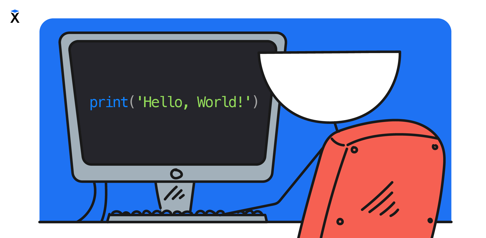

El aprendizaje de un nuevo lenguaje de programación tradicionalmente comienza con el programa 'Hello, World!'. Es un programa simple que muestra un saludo en la pantalla y nos introduce en la sintaxis y la estructura del nuevo lenguaje.

```text
Hello, World!
```



Esta tradición tiene ya más de cuarenta años, y nosotros también comenzaremos con ella. En la primera lección escribiremos el programa `Hello, World!`. En PHP este programa se ve así:

```php
<?php

print_r('Hello, World!');
```

La línea `<?php` al principio es una etiqueta especial que indica que a continuación viene código en PHP. Hablaremos de ella con más detalle en la próxima lección.

El comando `print_r()` muestra en la pantalla el texto indicado entre paréntesis. Al final se coloca un punto y coma `;` — así termina cada comando en PHP. En lugar del ejemplo, puedes escribir cualquier otro texto.

```php
<?php

print_r('Хекслет - школа программирования');
```

El comando sigue siendo el mismo, solo cambia el contenido de los paréntesis. Para que el programa entienda que se trata de texto, este se encierra entre comillas. Puedes usar comillas simples `'...'` o dobles `"..."`, pero las comillas de apertura y de cierre deben coincidir.

```php
<?php

print_r("Хекслет - школа программирования");
```

En PHP se acostumbra a usar comillas simples para las cadenas. Si dentro de la cadena hay un apóstrofo, las comillas simples romperán la sintaxis, por lo que en esos casos se usan comillas dobles.

```php
<?php

print_r("it's PHP"); // apóstrofo dentro, por eso comillas dobles
```

## Formas de mostrar en la pantalla

Además de `print_r()`, en PHP existe otro comando de salida — `echo`:

```php
<?php

echo 'Hello, World!';
// => Hello, World!
```

Para mayor comodidad, mostraremos el resultado de la ejecución de las líneas de código de esta manera: `// => RESULTADO`.

En situaciones simples no hay diferencia entre `echo` y `print_r()` — puedes usar cualquier comando. Pero cuando en la pantalla necesitas mostrar no solo números o cadenas, sino, por ejemplo, matrices, `echo` no podrá hacerlo, mientras que `print_r()` lo mostrará todo.

## El significado de los caracteres

El código está formado por comandos, y cada uno de ellos debe escribirse en una forma determinada. Además de las letras, en el código son importantes las comillas `'` y `"`, los paréntesis `()` y los signos de puntuación. Un signo omitido o confundido hará que el programa no se ejecute. ¿Intenta determinar qué error hay en cada una de las líneas?

```php
<?php

print_r("it's PHP"
print_r(it's PHP")
prin_r("it's PHP")
print_r('it's PHP")
print_r["it's PHP"];
```

Incluso una pequeña diferencia, por ejemplo una letra de más u otro signo, puede hacer que el programa no funcione. Esto también se aplica a las mayúsculas y minúsculas, es decir, a la diferencia entre letras grandes y pequeñas. Si en un texto normal `Hola` y `hola` se ven iguales, para el programa son textos diferentes. Los nombres de las funciones de PHP perdonan las diferencias de mayúsculas y minúsculas, pero los nombres de las variables y muchas otras construcciones que veremos más adelante no. Por eso lo más seguro es escribir el código exactamente como en los ejemplos.

## Dónde practicar

La teoría se asimila mejor cuando al mismo tiempo ejecutas el código y ves el resultado. Para ello sirve un intérprete en línea de PHP, donde el código se ejecuta directamente en el navegador. Todo lo que aparece en la lección conviene probarlo [en el intérprete en línea de PHP](https://3v4l.org/).

¿Cómo funciona esto técnicamente? Cualquier código escrito se pasa al intérprete de PHP, que ejecuta ese código y muestra en la pantalla el resultado de su trabajo.

```text
Código            Intérprete           Pantalla
┌────────────┐     ┌─────────────┐     ┌──────────────┐
│ print_r(…) │ ──→ │     PHP     │ ──→ │ Hello, World!│
└────────────┘     └─────────────┘     └──────────────┘
```
