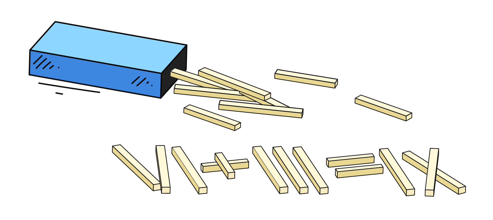

На базовом уровне компьютеры работают только с числами. Даже если вы пишете сложное приложение на современном языке программирования, внутри него всегда происходят многочисленные вычисления: сложение, вычитание, деление и т.д.



К счастью, чтобы начать программировать, достаточно знать обычную школьную арифметику. С нее мы и начнем.

## Сложение в PHP

В математике для сложения мы пишем 3 + 4. В PHP все точно так же:

```php
<?php

// Не забываем точку с запятой в конце, так как каждая строчка в коде — инструкция
3 + 4;
```

Этот код действительно можно запустить: интерпретатор выполнит вычисление. Но... он не сделает с результатом ничего. То есть 7 получится, но вы его не увидите.

## Чтобы увидеть результат, нужно его вывести

В реальной программе просто посчитать значение недостаточно. Нужно сделать что-то с результатом, например, показать его пользователю. При создании интернет-магазина недостаточно попросить интерпретатор посчитать стоимость товаров в корзине — нужно посчитать стоимость и показать цену покупателю.

Для этого используем уже привычную команду `print_r()`, которую в дальнейшем будем называть функцией:

```php
<?php

print_r(3 + 4);
```

Здесь сначала вычисляется сумма, затем она передается в функцию печати.

```text
print_r(3 + 4)
        └─┬─┘
          7

print_r(7)  →  7
```

Результат выполнения:

```text
7
```

Если записать это же выражение в виде строки, то мы получим совсем другой результат, на печать будет выведена строка «как есть»:

```php
<?php

print_r('3 + 4'); // выводит: 3 + 4
print_r(3 + 4);   // выводит: 7
```

## Другие арифметические операции

PHP поддерживает все привычные операции + несколько специфичных, связанных с тем, как хранятся и обрабатываются числа на компьютере:

| Операция               | Символ | Пример       | Результат |
|------------------------|--------|--------------|-----------|
| Сложение               | `+`    | `2 + 3`      | `5`       |
| Вычитание              | `-`    | `7 - 2`      | `5`       |
| Умножение              | `*`    | `4 * 3`      | `12`      |
| Деление                | `/`    | `8 / 2`      | `4`       |
| Возведение в степень   | `**`   | `3 ** 2`     | `9`       |
| Целочисленное деление  | `intdiv()` | `intdiv(7, 3)` | `2`   |
| Остаток от деления     | `%`    | `7 % 3`      | `1`       |

Эти знаки операций называют операторами. Вот как можно вывести результат деления и возведения в степень:

```php
<?php

print_r(8 / 2);  // => 4
print_r(3 ** 2); // => 9
```

## Числа с плавающей точкой

Помимо целых чисел в PHP есть числа с плавающей точкой, которые используются для работы с дробями. Такие числа записываются через точку:

```php
<?php

print_r(3.5 + 1.2); // => 4.7
print_r(10 / 4);    // => 2.5
```

Иногда мы используем их сами, когда нужно работать именно с дробными значениями, например при подсчете среднего или при работе с деньгами и измерениями. Но числа с плавающей точкой могут появляться и сами, например, в результате операции деления `/`:

```php
<?php

print_r(8 / 2); // => 4
print_r(7 / 2); // => 3.5
```

Если результат деления получился целым, PHP оставляет его целым числом, а дробный результат автоматически становится числом с плавающей точкой.

Причина выделения этого в отдельный тип: компьютеру нужно хранить целые значения и дробные значения по-разному. Для целых он выделяет одни структуры в памяти, для дробных выделяет другие. Поэтому в PHP, как и в других языках программирования, существует два разных вида чисел: int (целые) и float (с плавающей точкой).

На базовом уровне достаточно помнить: целые числа нужны, когда нет дробей, а числа с плавающей точкой нужны, когда дроби есть. Подробнее мы разберемся с ними дальше по курсу.

## Что такое остаток от деления (`%`)

Эта операция называется **взятие остатка от деления**. Она показывает, **что «остается»**, когда одно число делится на другое *не полностью*. Пример:

```php
<?php

print_r(7 % 3); // => 1
```

Почему результат равен 1?

- 7 делится на 3 дважды: 3 * 2 = 6
- До 7 остается 1, и это является остатком.

Другие примеры:

```php
<?php

print_r(10 % 4); // => 2 (10 делится на 4 дважды: 4 * 2 = 8, остаток 2)
print_r(15 % 5); // => 0 (делится без остатка)
```

Операция % часто используется в программировании, например:

- чтобы проверить, делится ли число нацело (если остаток 0)
- чтобы выполнять циклические действия, например, поведение по четным/нечетным индексам

Мы еще неоднократно встретим % в задачах и разберем его применение на практике.

## Оформление арифметических выражений

С точки зрения PHP между `3+4` и `3 + 4` нет разницы. Интерпретатор поймет оба варианта одинаково и в обоих случаях выполнит сложение. Разница только в оформлении кода. В программировании принято ставить пробелы вокруг арифметических операторов, потому что так выражения проще читать:

```php
<?php

3 + 4;
8 / 2;
7 % 3;
```

Вариант без пробелов тоже работает:

```php
<?php

3+4;
8/2;
7%3;
```

Но такой код выглядит менее аккуратно и его сложнее быстро воспринимать. Поэтому лучше сразу привыкать писать с пробелами вокруг операторов.
