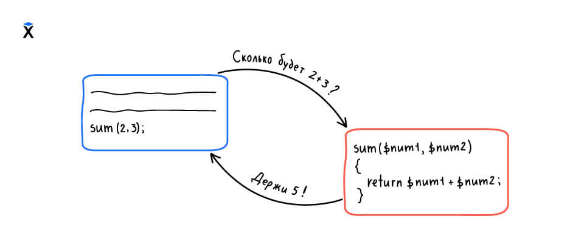

Функции, которые мы определяли в предыдущем уроке, заканчивали свою работу тем, что печатали на экран какие-то данные. Пользы от таких функций не очень много, так как результатом их работы невозможно воспользоваться внутри программы. В этом уроке мы научимся писать функции, которые **возвращают значения**. Такие функции отвечают на вопрос и отдают результат своей работы, как будто говорят: «Вот, держи, я посчитала».

Например, функция может вернуть строку с обработанным текстом или число, вычисленное по формуле. Возвращенное значение можно использовать дальше. Его сохраняют в переменную, передают в другую функцию или выводят на экран.



Чтобы функция отдала результат, в ней используется специальное ключевое слово `return`. Оно завершает выполнение функции и указывает, что именно нужно вернуть.

Вот пример функции, которая делает текст заглавным:

```php
<?php

function shout($name)
{
    return strtoupper($name);
}
```

Мы вызываем `shout()`, передаем туда имя и получаем строку в верхнем регистре. Эта строка является результатом функции:

```php
<?php

$result = shout('hexlet');
print_r($result); // => HEXLET

$result2 = shout('code-basics');
print_r($result2); // => CODE-BASICS
```

В отличие от `print_r()`, `return` ничего не печатает. Оно просто возвращает значение. Решение о том, что с ним делать, принимает вызывающий код.

При вызове функции `shout('hexlet')` сначала выполняется выражение `strtoupper($name)`. Оно возвращает строку `'HEXLET'`. Затем `return` отдает это значение наружу, туда, откуда была вызвана функция. В нашем случае это значение сохраняется в переменную `$result`, а потом выводится на экран через `print_r()`.

А что вернет функция, в которой нет `return`? Проверим на функции из прошлого урока, которая только печатает текст:

```php
<?php

function greeting()
{
    print_r('Hello, Hexlet!');
}

$message = greeting();
// Чтобы увидеть null, нужно воспользоваться функцией var_dump()
var_dump($message); // => NULL
```

Функция без возврата всегда возвращает `null` — специальное значение, которое означает «ничего нет».

## Возврат вычисленного выражения

Функции не обязаны просто возвращать параметр. Обычно в `return` указывается **выражение**, которое сначала вычисляется, а потом результат передается наружу.

```php
<?php

function fullName($first, $last)
{
    return ucfirst($first) . ' ' . ucfirst($last);
}
```

В этом примере мы собираем полное имя из имени и фамилии. Функция `ucfirst()` делает первую букву строки заглавной. Сначала выполняются оба вызова `ucfirst()`, затем строки объединяются через `.`, и уже готовая строка возвращается:

```php
<?php

$name = fullName('aria', 'stark');
print_r($name); // => Aria Stark
```

Возвращать можно и значение переменной. Здесь нужно руководствоваться принципами читаемости кода:

```php
<?php

function greeting()
{
    $message = 'Hello, Hexlet!';
    return $message;
}
```

Мы не возвращаем саму переменную. Всегда возвращается значение, которое находится в этой переменной.

## Многострочные функции

Иногда в теле функции нужно сделать несколько шагов, прежде чем получить результат. В таких случаях пишут несколько строк кода, а в конце используют `return`, чтобы вернуть итоговое значение.

Например, напишем функцию, которая форматирует имя: удаляет пробелы по краям и переводит все буквы в верхний регистр.

```php
<?php

function formatName($name)
{
    $clean = trim($name);
    $uppercased = strtoupper($clean);
    return $uppercased;
}
```

Сначала убираем пробелы с помощью функции `trim()`, затем переводим в верхний регистр с помощью `strtoupper()` и возвращаем итоговое значение:

```php
<?php

print_r(formatName('  hexlet  ')); // => HEXLET
```

Подобный код встречается в реальных программах постоянно. Например, когда пользователь регистрируется на сайте, он может ввести email с лишними пробелами или буквами в разном регистре: `  SuppORT@hexlet.IO`. Перед записью в базу данных такой email готовят точно так же: обрезают пробельные символы и приводят к нижнему регистру.

## Код после `return`

Когда PHP доходит до инструкции `return`, выполнение функции останавливается. Все, что написано после нее внутри функции, **не будет выполнено**:

```php
<?php

function greeting()
{
    return 'Hello, Hexlet!';
    print_r('Я никогда не выполнюсь');
}
```

Поэтому `return` всегда пишут в конце логики. Однако таких концов внутри функции может быть много. Подробнее мы этого коснемся, когда доберемся до условных конструкций.

Даже если функция возвращает данные, это не ограничивает ее в том, что она печатает. Кроме возврата данных мы можем и печатать:

```php
<?php

function greeting()
{
    print_r('Я появлюсь в консоли');
    return 'Hello, Hexlet!';
}

// И напечатает текст на экран, и вернет значение
$message = greeting();
```

Вопрос на самопроверку. Что вернет вызов этой функции?

```php
<?php

// Определение
function run()
{
    // Возврат
    return 5;
    return 10;
}

// Использование
run(); // => ?
```
