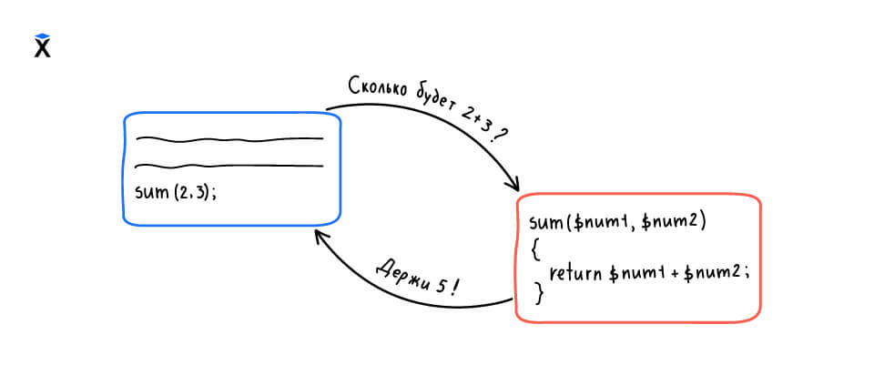

Функции, которые мы определяли в предыдущих уроках, заканчивали свою работу тем, что печатали на экран какие-то данные:

```php
<?php

function greeting()
{
    print_r('Hello, Hexlet!');
}
```

Пользы от таких функций не очень много, так как результатом их работы невозможно воспользоваться внутри программы. Чтобы это можно было сделать, нужно возвращать значение из функции, чему мы и научимся в этом уроке.

Рассмотрим задачу обработки электронной почты. Когда пользователь регистрируется на каком-то сайте, он может ввести email любым способом:

* Добавить случайно пробелы в начале или в конце `_support@hexlet.io__`
* Использовать буквы в разном регистре `SUPPORT@hexlet.io`

Если мы сохраним email в таком виде в базу данных, то пользователь не сможет войти на сайт. Такое возможно, если он будет вбивать адрес без пробелов и в другом регистре.

Чтобы этого не произошло, email нужно подготовить к записи в базу. Его нужно привести к нижнему регистру и обрезать пробельные символы по краям строки. Такая задача решается в пару строчек:

```php
<?php

function saveEmail()
{
    $email = "  SuppORT@hexlet.IO";
    // Обрезаем пробельные символы
    // Функция trim() удаляет пробелы из начала и конца строки
    $trimmedEmail = trim($email);
    $preparedEmail = strtolower($trimmedEmail);
    print_r($preparedEmail);
    // Здесь будет запись в базу данных
}
```

Этот код стал возможен только благодаря возврату значения. Функции `trim()` и `strtolower()` ничего не печатают на экран. Они возвращают результат своей работы, и поэтому мы можем записать его в переменные.

Если бы функции вместо возврата результата печатали на экран, мы бы не могли присвоить результат их работы переменной. Как мы не можем сделать с определенной выше функцией `greeting()`:

```php
<?php

$message = greeting();
// Чтобы увидеть null, нужно воспользоваться функцией var_dump()
var_dump($message); // => NULL
```

Изменим функцию `greeting()` так, чтобы она начала возвращать данные вместо их печати. Для этого нам понадобится выполнить возврат вместо печати на экран:

```php
<?php

function greeting()
{
    return 'Hello, Hexlet!';
}
```

`return` — особая инструкция, которая берет выражение, записанное справа. Далее она отдает его наружу тому коду, который вызвал метод. Как только PHP натыкается на `return`, выполнение функции на этом завершается:



```php
<?php

// Теперь мы можем использовать результат работы функции
$message = greeting();
print_r($message); // => 'Hello, Hexlet!'
// И даже выполнить какие-то действия над результатом
print_r(strtoupper($message)); // => 'HELLO, HEXLET!'
```

Любой код после `return` не выполняется:

```php
<?php

function greeting()
{
    return 'Hello, Hexlet!';
    print_r('Я никогда не выполнюсь');
}
```

Даже если функция возвращает данные, это не ограничивает ее в том, что она печатает. Кроме возврата данных мы можем и печатать:

```php
<?php

function greeting()
{
    print_r('Я появлюсь в консоли');
    return 'Hello, Hexlet!';
}
// И напечатает текст на экран и вернет значение
$message = greeting();
```

Возвращать можно не только конкретное значение. Так как `return` работает с выражениями, то справа от него может появиться почти всё что угодно. Здесь нужно руководствоваться принципами читаемости кода:

```php
<?php

function greeting()
{
    $message = 'Hello, Hexlet!';
    return $message;
}
```

Здесь мы не возвращаем переменную. Всегда возвращается значение, которое находится в этой переменной. Ниже пример с вычислениями:

```php
<?php

function doubleFive()
{
    // или return 5 + 5
    $result = 5 + 5;
    return $result;
}
```

Вопрос на самопроверку. Что выведет этот код?

```php

<?php
// Определение
function run()
{
    // Возврат
    return 5;
    return 10;
}
// Использование
run(); // => ?
```
