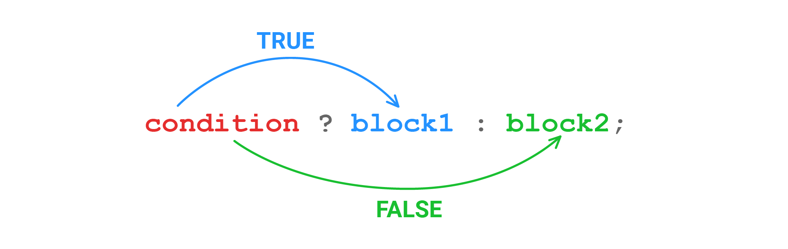

Look at the definition of this function, which returns the modulus of a given number:

```php
<?php

function abs($number)
{
    if ($number >= 0) {
        return $number;
    }

    return -$number;
}

abs(10);  // 10
abs(-10); // 10
```

Can we write it more concisely? Something like return `return ОТВЕТ В ЗАВИСИМОСТИ ОТ УСЛОВИЯ`? That would require an expression following return, but if is a statement, not an expression.

In PHP, there's a construct that works like the*if-else* construct, but is an expression. It's called the ternary operator.

The ternary operator is the only JavaScript operator that takes three operands:

```php
<?php

function abs($number)
{
    return $number >= 0 ? $number : -$number;
}
```

It generally looks like this:

```text
<predicate> ? <expression on true> : <expression on false>
```



Let's rewrite the initial version of `getTypeOfSentence()` in the same way:

Before:

```php
<?php

function getTypeOfSentence($sentence)
{
    $lastChar = substr($sentence, -1);

    if ($lastChar === '?') {
        return 'question';
    }

    return 'normal';
}
```

After:

```php
<?php

function getTypeOfSentence($sentence)
{
    $lastChar = substr($sentence, -1);

    return ($lastChar === '?') ? 'question' : 'normal';
}

getTypeOfSentence('Hodor');  // normal
getTypeOfSentence('Hodor?'); // question
```

---

If you remember the main strength of expressions, then you probably figured out by now that you can nest a ternary operator in another ternary operator. ** Don't do it :)** This sort of code is hard both to read and to debug, it's very bad practice.
