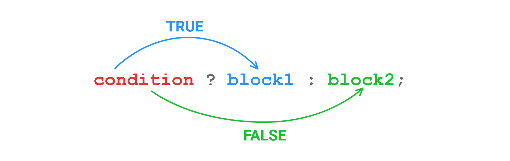

Посмотрите на определение функции, которая возвращает модуль переданного числа:

```php
<?php

function abs(int $number): int
{
    if ($number >= 0) {
        return $number;
    }

    return -$number;
}

print_r(abs(10) . "\n");  // => 10
print_r(abs(-10) . "\n"); // => 10
```

Но можно записать более лаконично. В PHP есть конструкция, которая работает как *if-else*, но при этом является выражением — ее результат можно сразу вернуть из функции. Она называется **тернарный оператор** и является единственным оператором в PHP, который требует три операнда:

```php
<?php

function abs(int $number): int
{
    return $number >= 0 ? $number : -$number;
}
```

Общий паттерн выглядит так:

```text
<predicate> ? <expression on true> : <expression on false>
```



Давайте перепишем начальный вариант `getTypeOfSentence()` аналогично. Посмотрим, как было:

```php
<?php

function getTypeOfSentence(string $sentence): string
{
    $lastChar = $sentence[-1];

    if ($lastChar === '?') {
        return 'question';
    }

    return 'normal';
}
```

А теперь — как стало:

```php
<?php

function getTypeOfSentence(string $sentence): string
{
    $lastChar = $sentence[-1];

    return $lastChar === '?' ? 'question' : 'normal';
}

print_r(getTypeOfSentence('Hodor') . "\n");  // => normal
print_r(getTypeOfSentence('Hodor?') . "\n"); // => question
```

Вы уже могли догадаться, что тернарный оператор можно вкладывать в тернарный оператор. Это возможно, но лучше так не делать. Такой код тяжело читать и отлаживать, поэтому вложенные тернарные операторы считаются очень плохой практикой.
