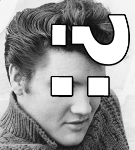

Imagine the following problem: on a website, users can have names and nicknames. If there's a name, we need to address the person by their name. If there's no name, we address them by their nickname. Let's try to assemble a greeting string for a person according to these requirements:

```php
<?php

function generateGreeting(string $name, string $nickname): string
{
    if ($name) {
        return "Hello, {$name}!";
    } else {
        return "Hello, {$nickname}!";
    }
}

generateGreeting('Bob', 'CoolBob86'); // 'Hello, Bob!'
generateGreeting('', 'CoolBob86');    // 'Hello, CoolBob86!'
```

We've taken advantage of the fact that PHP converts types. In the `if ($name)` code, PHP turns `$name` into the `bool` type. If it was an empty string, the result is `false`. Otherwise, the result is `true`.

With a ternary operator you can get a shorter notation:

```php
<?php

function generateGreeting(string $name, string $nickname): string
{
    return $name ? "Hello, {$name}!" : "Hello, {$nickname}!";
}
```

This is a common case — we operate with `bool` values and get:

* The first value if it's `true`
* The second value otherwise

In PHP, there's a special operator for such cases:

```php
<?php

function generateGreeting(string $name, string $nickname): string
{
    $user = $name ?: $nickname;
    return "Hello, {$user}!";
}
```

The `?:` operator is a binary operator that returns the first operand if it's true, and the second otherwise. It's also called Elvis, because this word
sounds like _else if_. And also because of its visual resemblance to Elvis Presley:


