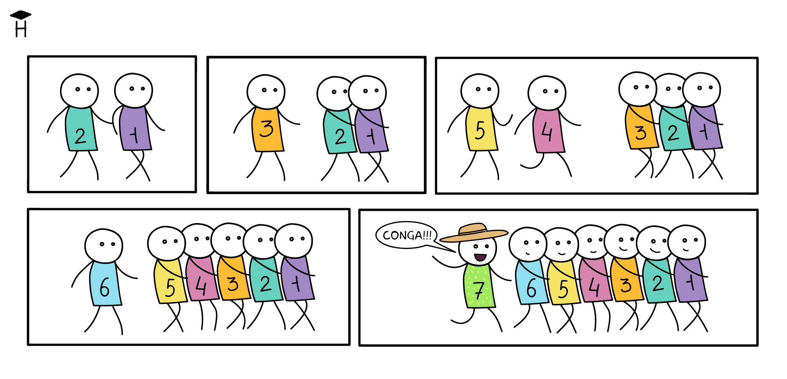

Отдельный класс задач, который не обходится без циклов, называется **агрегированием данных**. К таким задачам относятся поиск максимального или минимального значения, суммы, среднего арифметического. В их случае результат зависит от всего набора данных. В этом уроке разберем, как агрегация применяется к числам и строкам.



Допустим, нам нужно найти сумму набора чисел. Реализуем функцию, которая складывает числа в указанном диапазоне, включая границы. **Диапазон** представляет собой ряд чисел от конкретного начала до определенного конца. Например, диапазон [1, 10] включает целые числа от одного до десяти.

```php
<?php

sumNumbersFromRange(5, 7); // 5 + 6 + 7 = 18
sumNumbersFromRange(1, 2); // 1 + 2 = 3

// [1, 1] Диапазон с одинаковым началом и концом – тоже диапазон
// Он в себя включает ровно одно число – саму границу диапазона
sumNumbersFromRange(1, 1); // 1
sumNumbersFromRange(100, 100); // 100
```

Чтобы реализовать такой код, понадобится цикл, так как сложение чисел является итеративным процессом, то есть повторяется для каждого числа. Количество итераций зависит от размера диапазона. Вот код этой функции:

```php
<?php

function sumNumbersFromRange(int $start, int $finish): int
{
    // Технически можно менять $start
    // Но входные аргументы нужно оставлять в исходном значении
    // Это сделает код проще для анализа
    $i = $start;
    $sum = 0; // Инициализация суммы

    while ($i <= $finish) { // Двигаемся до конца диапазона
        $sum = $sum + $i; // Считаем сумму для каждого числа
        $i = $i + 1; // Переходим к следующему числу в диапазоне
    }

    // Возвращаем получившийся результат
    return $sum;
}
```

Общая структура цикла здесь стандартна. В нем есть три компонента:

* Счетчик, который инициализируется начальным значением диапазона
* Сам цикл с условием остановки при достижении конца диапазона
* Изменение счетчика в конце тела цикла

Количество итераций в таком цикле равно `$finish - $start + 1`. То есть для диапазона от 5 до 7 – это 7 - 5 + 1, то есть три итерации.

Главные отличия от обычной обработки связаны с логикой вычислений результата. В задачах на агрегацию всегда есть какая-то переменная, которая хранит внутри себя результат работы цикла. В коде выше это `$sum`. На каждой итерации цикла происходит ее изменение, прибавление следующего числа в диапазоне: `$sum = $sum + $i`.

Весь процесс выглядит так:

```php
<?php

// Для вызова sumNumbersFromRange(2, 5);
$sum = 0;
$sum = $sum + 2; // 2
$sum = $sum + 3; // 5
$sum = $sum + 4; // 9
$sum = $sum + 5; // 14
// 14 – результат сложения чисел в диапазоне [2, 5]
```

Наглядно процесс накопления суммы выглядит так:

```text
sumNumbersFromRange(2, 5):

i=2: sum = 0 + 2 = 2
i=3: sum = 2 + 3 = 5
i=4: sum = 5 + 4 = 9
i=5: sum = 9 + 5 = 14
                    └── результат
```

У переменной `$sum` есть начальное значение, равное 0. Зачем вообще задавать значение? Любая повторяющаяся операция начинается с какого-то значения. Нельзя просто так объявить переменную и начать с ней работать внутри цикла. Это может приводить к ошибкам:

```php
<?php

// начальное значение не задано
// PHP автоматически делает его равным NULL
$sum;

// первая итерация цикла
$sum = $sum + 2; // ?
```

В результате такого вызова внутри `$sum` окажется верный результат, но интерпретатор выведет предупреждение: `PHP Warning:  Undefined variable $sum`. Оно возникает из-за попытки использовать неопределенную переменную. Значит какое-то значение все же нужно. Почему в коде выше выбран 0? Очень легко проверить, что все остальные варианты приведут к неверному результату. Если начальное значение будет равно 1, то результат получится на 1 больше, чем нужно.

В математике у каждой операции существует **нейтральный элемент этой операции**. Операция с этим элементом не изменяет то значение, над которым проводится операция:

* Ноль при сложении: любое число + ноль = само число
* Ноль при вычитании: любое число - ноль = само число
* Пустая строка при конкатенации: `'' . 'string'` будет `'string'`

Поэтому если бы мы умножали, то вместо `0` использовали бы `1`.
